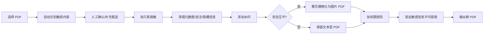

# Windows 本地 PDF 脱敏水印权限工具 - OBD 开放式落地总纲

版本：V1.0 落地基线  
日期：2026-06-07  
目标平台：Windows 10 / Windows 11 x64  
交付目标：本地运行、无云端依赖、目标电脑无需预装 Python 或 PDF 依赖

## 1. 项目结论

第一版采用：

- 核心 PDF 处理：PyMuPDF
- 权限密码与 PDF 安全收尾：pikepdf，必要时附带 qpdf.exe 作为命令行后备工具
- 本地窗口：Tkinter
- PDF 页面预览与人工框选：PyMuPDF 渲染 + Pillow + Tkinter Canvas
- 打包：PyInstaller 输出便携版，Inno Setup 输出安装版

第一版不做大而全的 PDF 平台，只做一个小而稳的 Windows 本地工具：

1. 输入 PDF。
2. 自动识别常见敏感信息。
3. 用户人工确认和补充框选。
4. 执行真正脱敏。
5. 加水印。
6. 可选安全压平/栅格化输出。
7. 加权限密码，限制复制、修改、页面提取。
8. 输出新的 PDF，不覆盖原文件。

## 2. OBD 定义

这里的 OBD 按“开放式落地文档”理解，即：

- Open：模块边界开放，后续可替换 OCR、GUI、加密工具、规则引擎。
- Build：依赖、目录、打包、验收全部写清楚，开发可以直接按文档开工。
- Documented：产品、技术、开发、打包、测试、升级路线都有独立文档。

## 3. 第一版落地边界

### 必做

- Windows 本地 GUI。
- 单个 PDF 输入，单个 PDF 输出。
- 文本型 PDF 自动脱敏。
- 手动框选脱敏。
- 真脱敏，不只是盖黑框。
- 水印文字配置。
- 权限密码配置。
- 安全压平输出开关。
- 标准元数据清理。
- 处理前后结果验证。
- 便携版 zip。
- 安装版 exe。

### 不做

- 不做云端上传。
- 不做网页账号系统。
- 不做多人协作。
- 不做 DRM。
- 不做绕过他人 PDF 密码或权限。
- 不在 V1 做完整 OCR 自动识别。
- 不承诺 PDF 权限密码能防专业工具绕过。

## 4. 推荐文档阅读顺序

1. `01_PRD_Windows本地PDF脱敏水印权限工具_V1.md`
2. `02_技术设计文档_V1.md`
3. `03_开发文档_V1.md`
4. `04_依赖锁定与离线打包发布文档_Windows.md`
5. `05_验收测试与安全验证清单.md`
6. `06_V2升级规划.md`

## 5. 总体流程

## 6. 关键原则

- 脱敏优先于水印。
- 真脱敏优先于视觉遮盖。
- 自动识别只做候选，人工确认是 V1 的安全阀。
- 高安全场景默认建议开启压平输出。
- 权限密码是防普通复制和修改，不是强安全。
- 打包产物必须能在没有 Python、pip、qpdf、PyMuPDF 的电脑上运行。

## 7. 主要风险

| 风险 | 处理策略 |
|---|---|
| PDF 文本分块导致自动识别漏检 | 增加人工预览确认；自动提取结果只作为候选 |
| 扫描件没有文本层 | V1 用手动框选；V2 加 OCR |
| 只盖黑框导致底层文字仍可复制 | 使用 PyMuPDF redaction 并 apply；高安全模式压平 |
| 权限密码可被专业工具绕过 | 文档明确边界；用水印和压平提升实际防护 |
| 目标电脑无依赖 | PyInstaller 打包 Python 与依赖；qpdf.exe 随包附带 |
| PyMuPDF AGPL 许可 | 内部使用可先落地；商业闭源发布前需确认商业授权或替代库 |

