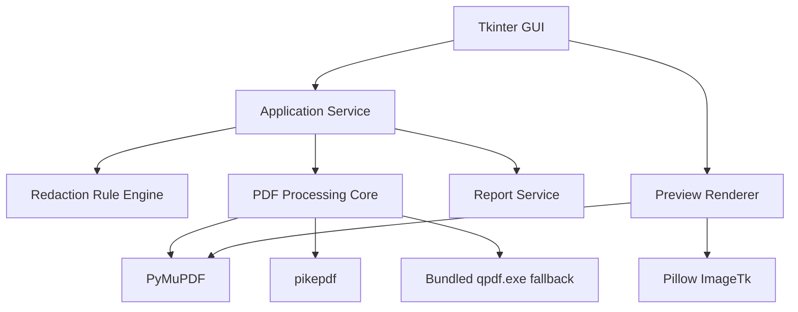
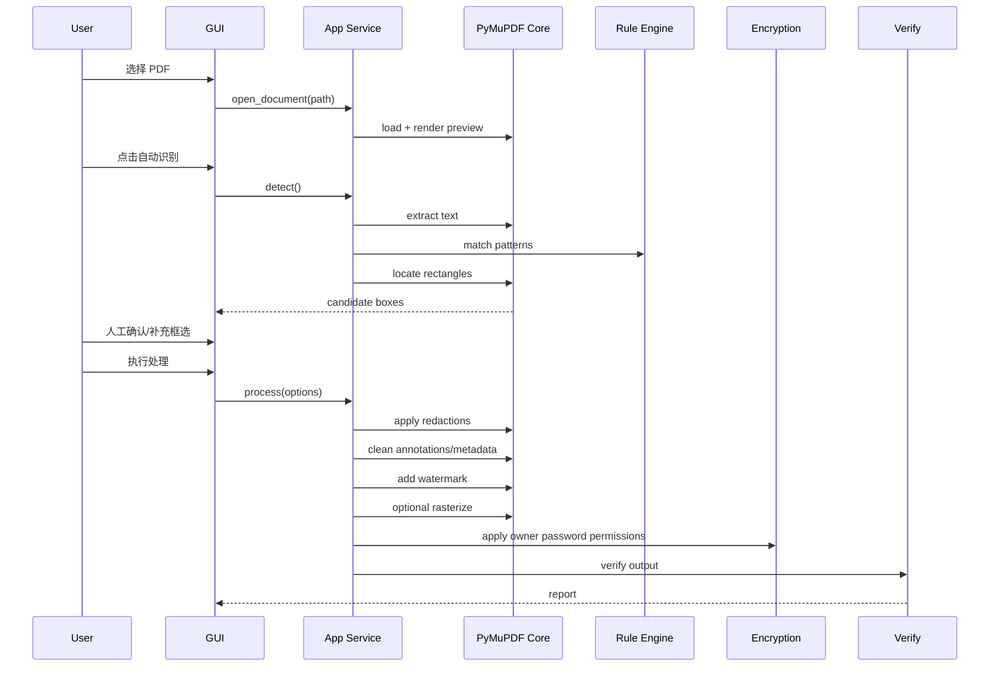

# 技术设计文档：Windows 本地 PDF 脱敏水印权限工具 V1

版本：V1.0  
日期：2026-06-07  
核心路线：Python + PyMuPDF + pikepdf/qpdf + Tkinter + PyInstaller

## 1. 技术结论

V1 以 PyMuPDF 为核心底座：

- PyMuPDF 负责 PDF 打开、页面渲染、文本提取、位置查找、redaction、加水印、栅格化。
- pikepdf 负责 PDF 权限密码、元数据收尾、PDF 结构层清理。
- qpdf.exe 随包附带，作为权限加密和验证的命令行后备工具。
- Tkinter 做 Windows 本地 GUI。
- Pillow 做页面预览图片与 Tkinter Canvas 的适配。

## 2. 架构图



## 3. 模块划分

| 模块 | 目录建议 | 职责 |
|---|---|---|
| UI | `src/pdf_guard/ui` | 窗口、表单、预览、框选 |
| 应用服务 | `src/pdf_guard/app` | 串联流程、状态管理 |
| PDF 核心 | `src/pdf_guard/pdf` | 打开、渲染、脱敏、水印、压平 |
| 规则引擎 | `src/pdf_guard/rules` | 正则和关键词匹配 |
| 权限加密 | `src/pdf_guard/security` | pikepdf/qpdf 权限密码 |
| 验证报告 | `src/pdf_guard/verify` | 敏感信息复检、处理报告 |
| 配置 | `src/pdf_guard/config` | 默认配置、用户配置 |
| 资源 | `resources` | 图标、字体、qpdf 二进制 |
| 打包脚本 | `packaging` | PyInstaller spec、Inno Setup 脚本 |

## 4. 处理流水线

### 4.1 标准流程



### 4.2 推荐最终顺序

1. 打开 PDF。
2. 自动识别候选敏感内容。
3. 用户确认和补充框选。
4. 应用 redaction。
5. 清理隐藏信息。
6. 添加水印。
7. 如果开启安全压平，整页渲染成图片 PDF。
8. 加 owner password 和权限限制。
9. 输出验证报告。

水印放在压平之前，原因是压平后水印会成为页面图片的一部分，普通 PDF 编辑器更难单独移除。

## 5. 自动脱敏设计

### 5.1 规则

建议规则文件：`src/pdf_guard/rules/default_patterns.py`

规则包括：

- `CN_MOBILE`
- `CN_ID_CARD`
- `EMAIL`
- `BANK_CARD`
- `USCC`
- `CUSTOM_KEYWORD`

### 5.2 定位策略

V1 使用两阶段定位：

1. `page.get_text("text")` 提取整页文本，正则找到候选字符串。
2. 对每个候选字符串调用 `page.search_for(value)` 获取矩形位置。

优点：实现简单，准确时效果好。  
限制：如果 PDF 内部把一个号码拆成多个 span 或字符，`search_for` 可能定位失败。

定位失败时：

- 在候选列表里显示“需要人工框选”。
- 不自动跳过风险提示。

### 5.3 手动框选坐标

预览使用像素坐标，PDF 使用 point 坐标。需要维护缩放比例：

```text
pdf_x = canvas_x / zoom
pdf_y = canvas_y / zoom
pdf_rect = Rect(x0 / zoom, y0 / zoom, x1 / zoom, y1 / zoom)
```

如果页面有旋转，渲染预览和 redaction 坐标必须使用同一套页面变换矩阵。V1 建议先 normalize page rotation，再预览和处理。

## 6. 真脱敏设计

对每个确认区域：

1. `page.add_redact_annot(rect, fill=(0,0,0))`
2. `page.apply_redactions()`

V1 默认黑块。  
白块 + “已脱敏”模式可先 redaction 填白，再插入文字。

注意：

- 必须调用 `apply_redactions()`。
- 处理后必须保存到新文件。
- 验证阶段要重新打开输出文件提取文本。

## 7. 水印设计

文字水印两种模式：

### 单个斜向水印

- 居中。
- 45 度。
- 透明灰色。

### 平铺水印

- 横向和纵向按间距铺满。
- 每页重复。
- 适合防传播。

水印参数：

| 参数 | 默认值 |
|---|---|
| text | 内部资料 禁止外传 |
| font_size | 42 |
| opacity | 0.18 |
| rotate | 45 |
| color | #999999 |
| tile | true |

## 8. 安全压平设计

安全压平流程：

1. 对已脱敏且已加水印的 PDF 逐页渲染。
2. DPI 默认 200，用户可选 150/200/300。
3. 每页生成图片。
4. 新建 PDF，把图片按原页面尺寸铺满。
5. 保存新 PDF。

建议：

- 默认 DPI 200。
- 大文件提示用户处理时间和文件体积会增加。
- 压平后不要保留文本层。

## 9. 权限密码设计

默认使用 pikepdf：

- user password 为空。
- owner password 由用户输入。
- AES-256。
- 禁止 extract。
- 禁止 modify。
- 禁止 annotate。
- 禁止 form。
- 禁止 assemble。
- print 默认允许低分辨率或完全禁止，按用户选择。

qpdf.exe 作为后备工具，可用于最终验证或替代加密。

权限密码必须写在最终 PDF 上，不能在压平之前写，否则中间步骤会破坏或重写权限设置。

## 10. 隐藏信息清理

V1 清理策略：

- 清空 DocumentInfo。
- 清空 XMP metadata。
- 删除附件。
- 删除文档级 JavaScript/action。
- 清理非必要批注。
- 可选删除书签/目录。

数字签名、表单、复杂交互对象：V1 不保证保留，安全模式下默认破坏这些结构。

## 11. 错误处理

| 错误 | 行为 |
|---|---|
| PDF 损坏 | 尝试 pikepdf 修复；失败则提示 |
| PDF 有打开密码 | 要求用户输入密码 |
| PDF 权限限制 | 不绕过；如能打开则正常处理用户自己的文件 |
| 输出路径占用 | 自动生成新文件名 |
| 压平内存不足 | 降低 DPI 并提示 |
| 自动定位失败 | 列出候选并要求人工框选 |

## 12. 日志

日志位置：

```text
%LOCALAPPDATA%\LocalPDFGuard\logs\app.log
```

日志内容：

- 应用版本。
- 依赖版本。
- 输入文件 hash。
- 输出文件路径。
- 页面数量。
- 自动识别命中数量。
- 脱敏区域数量。
- 是否压平。
- 权限设置。
- 错误堆栈。

日志不要记录完整敏感文本。可以记录 hash 或类型和页码。

## 13. 许可风险

PyMuPDF 是 AGPL/商业双许可。内部本地使用可先落地验证；如果后续要闭源商业分发，应购买商业授权或评估替代方案。

pikepdf 是 MPL-2.0，适合商业闭源集成，但若修改 pikepdf 源码本身，需要发布修改部分源码。

