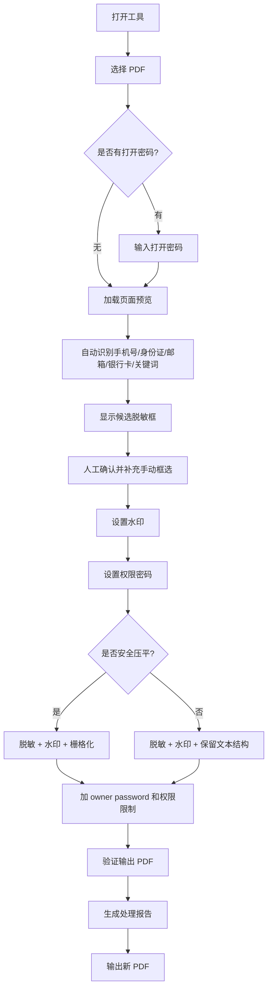

# 主要流程与开发启动说明

版本：V1.0  
日期：2026-06-07

## 1. 产品主流程



## 2. 技术处理主流程

1. PyMuPDF 打开 PDF。
2. PyMuPDF 提取文本。
3. 规则引擎匹配敏感内容。
4. PyMuPDF `search_for` 定位候选矩形。
5. Tkinter Canvas 展示页面和脱敏框。
6. 用户补充手动框选。
7. PyMuPDF `add_redact_annot` 添加脱敏注释。
8. PyMuPDF `apply_redactions` 执行真脱敏。
9. 清理 metadata、批注、附件、可疑动作。
10. PyMuPDF 添加文字水印。
11. 可选 PyMuPDF 渲染整页并重建图片型 PDF。
12. pikepdf 设置 owner password 和权限限制。
13. qpdf/pikepdf 验证加密和权限。
14. PyMuPDF 重新提取文本验证敏感内容是否残留。
15. 输出 PDF 和处理报告。

## 3. 开发启动顺序

### 第一步：建基础工程

- 创建 `local-pdf-guard` 项目结构。
- 加 `pyproject.toml`。
- 加 `requirements.lock.txt`。
- 加日志模块。
- 加 CLI 临时入口，先不做 GUI。

### 第二步：做 PDF 核心闭环

先完成命令行版本：

```text
input.pdf -> 自动识别 -> 真脱敏 -> 加水印 -> 加权限密码 -> output.pdf
```

这个闭环通过后再做 GUI，避免 UI 和核心逻辑一起出问题。

### 第三步：做 GUI

- 文件选择。
- 页面预览。
- 候选框显示。
- 手动框选。
- 参数配置。
- 处理进度。
- 报告展示。

### 第四步：做安全压平

- 150/200/300 DPI。
- 大文件提醒。
- 压平后文本提取验证。

### 第五步：做打包

- PyInstaller 便携版。
- qpdf.exe 随包。
- Inno Setup 安装版。
- 干净 Windows 机器验收。

## 4. 第一轮开发最小任务

第一轮不要直接做完整 GUI，建议先交付核心命令行：

```powershell
LocalPDFGuardCore.exe `
  --input input.pdf `
  --output output.pdf `
  --watermark "内部资料 禁止外传" `
  --owner-password "change-me" `
  --redact-mobile `
  --redact-id-card `
  --redact-email
```

验收点：

- 输出 PDF 存在。
- 原 PDF 不变。
- 敏感文本提取不到。
- 水印可见。
- 权限限制存在。

## 5. 第二轮开发任务

在核心闭环稳定后加 GUI：

- 打开 PDF。
- 自动识别按钮。
- 预览候选框。
- 手动框选。
- 执行处理。
- 显示报告。

## 6. 第三轮开发任务

打包与发布：

- 制作 wheelhouse。
- PyInstaller 生成 onedir 便携版。
- Inno Setup 生成安装版。
- 干净机器测试。
- 输出 SHA256。
- 整理 license。

## 7. 成功标准

V1 开发完成的判断标准：

- 没有 Python 的 Windows 机器可以运行。
- 便携版解压即用。
- 安装版可安装、可卸载。
- 文本型 PDF 可以真脱敏。
- 扫描件可以手动框选脱敏。
- 水印、压平、权限密码都可用。
- 输出验证报告能提示残留风险。

