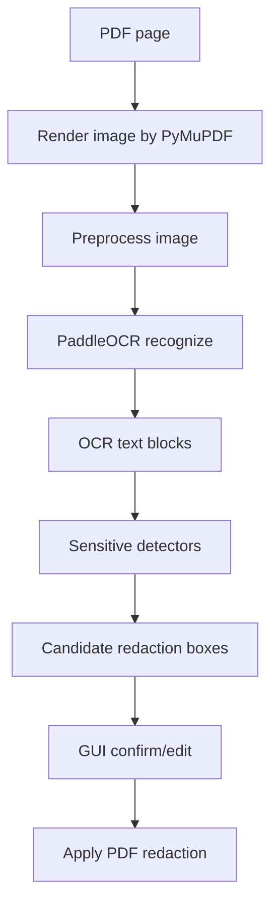

# 技术方案: LocalPDFGuard v1.1

版本: v1.1  
日期: 2026-06-07  
基础技术栈: Python + PyMuPDF + pikepdf + Pillow + Tkinter + PyInstaller  
新增技术栈: PaddleOCR CPU 本地 OCR，GitHub Actions Windows 自动发布

## 1. 总体架构

v1.1 保持 v0.1.0 的核心处理底座不变:

- PyMuPDF: PDF 打开、渲染、文本提取、redaction、水印、压平。
- pikepdf: 权限密码、PDF 结构清理、元数据处理。
- Pillow: 页面预览图、OCR 输入图片中间处理。
- Tkinter: Windows 本地 GUI。
- PyInstaller: 便携版可执行文件。

新增四条能力线:

- GUI 画布交互层。
- OCR 候选识别层。
- 批量任务执行层。
- 安全验证与发布自动化层。

## 2. 模块结构

建议在当前仓库基础上增量演进:

```text
src/pdf_guard/
  ui/
    app.py
    coordinates.py
    preview_canvas.py
    box_editor.py
    batch_panel.py
    output_actions.py
  ocr/
    __init__.py
    models.py
    provider.py
    paddle_provider.py
    umi_provider.py
    preprocess.py
    detectors.py
    cache.py
  batch/
    __init__.py
    models.py
    runner.py
    report.py
  report/
    __init__.py
    models.py
    writer.py
  security.py
  verify.py
  pipeline.py
```

## 3. GUI 框编辑设计

### 3.1 状态模型

新增 UI 内部模型:

```python
@dataclass
class EditableBox:
    id: str
    page_index: int
    rect_pdf: tuple[float, float, float, float]
    source: str
    category: str
    confidence: float
    selected: bool = False
    confirmed: bool = True
```

UI 状态:

```python
@dataclass
class PreviewState:
    page_index: int
    zoom: float
    scroll_x: int
    scroll_y: int
    tool: str  # select, draw
    active_box_id: str | None
    drag_mode: str | None  # move, n, s, e, w, nw, ne, sw, se
```

### 3.2 Canvas 事件

绑定事件:

- `<ButtonPress-1>`: 命中测试，决定选框、画新框或开始拖拽。
- `<B1-Motion>`: 拖拽移动、缩放或绘制新框。
- `<ButtonRelease-1>`: 提交编辑结果。
- `<Delete>`: 删除选中框。
- `<Control-MouseWheel>`: 缩放。
- `<MouseWheel>`: 滚动。
- `<Shift-MouseWheel>`: 横向滚动。
- `<Button-3>`: 右键菜单。

### 3.3 坐标转换

继续使用 PDF point 坐标作为真实数据源，Canvas 坐标只用于显示。

```text
canvas_x = pdf_x * zoom
canvas_y = pdf_y * zoom
pdf_x = canvas_x / zoom
pdf_y = canvas_y / zoom
```

要求:

- 所有框保存为 PDF 坐标。
- 缩放和滚动不能改变 PDF 坐标。
- 页面旋转必须走统一转换函数。
- 每次渲染后按当前 `zoom` 重新绘制所有框。

### 3.4 命中测试

命中优先级:

1. 角点缩放手柄。
2. 边缘缩放手柄。
3. 框内部移动。
4. 空白区域画新框。

手柄尺寸:

- 屏幕固定 8 到 10 px。
- 不随 zoom 线性变大。

### 3.5 最小框约束

- 最小宽高: 4 PDF points。
- 超出页面边界时自动裁剪。
- 反向拖拽时自动规范化 `x0 <= x1`、`y0 <= y1`。

## 4. OCR 处理设计

### 4.1 OCR 流程



### 4.2 OCR 结果模型

```python
@dataclass
class OcrBlock:
    page_index: int
    text: str
    bbox_px: tuple[float, float, float, float]
    confidence: float
    engine: str

@dataclass
class OcrCandidate:
    page_index: int
    text: str
    category: str
    rect_pdf: tuple[float, float, float, float]
    confidence: float
    reason: str
```

### 4.3 坐标映射

OCR 输入图像来自 PyMuPDF 渲染:

```python
matrix = fitz.Matrix(dpi / 72, dpi / 72)
pix = page.get_pixmap(matrix=matrix, alpha=False)
```

转换公式:

```text
scale_x = page.rect.width / image_width
scale_y = page.rect.height / image_height
pdf_x0 = img_x0 * scale_x
pdf_y0 = img_y0 * scale_y
pdf_x1 = img_x1 * scale_x
pdf_y1 = img_y1 * scale_y
```

旋转页面要求:

- v1.1 优先使用渲染后的可视坐标和预览坐标统一处理。
- 加测试覆盖 0、90、180、270 度页面。

### 4.4 识别器

新增 `ocr/detectors.py`:

- `detect_mobile(blocks) -> list[OcrCandidate]`
- `detect_id_card(blocks) -> list[OcrCandidate]`
- `detect_name(blocks) -> list[OcrCandidate]`
- `detect_address(blocks) -> list[OcrCandidate]`
- `merge_adjacent_blocks(blocks) -> list[OcrBlock]`

文本规则:

- 数字类先做 OCR 字符纠错，再做正则。
- 姓名和地址先按关键词找邻近文本块。
- 同一敏感信息跨多个 OCR block 时先合并。

## 5. 批量处理设计

### 5.1 数据模型

```python
@dataclass
class BatchItem:
    input_path: Path
    output_path: Path
    status: str  # pending, running, success, failed, canceled
    page_count: int | None = None
    detected_count: int = 0
    redacted_count: int = 0
    risk_level: str | None = None
    error_message: str | None = None

@dataclass
class BatchOptions:
    input_paths: list[Path]
    output_dir: Path
    recursive: bool
    enable_ocr: bool
    continue_on_error: bool
    process_options: ProcessOptions
```

### 5.2 任务执行

实现 `BatchRunner`:

- 后台线程执行，避免 Tkinter 主线程卡死。
- 用 queue 把进度事件回传 UI。
- 每个文件单独 try/except。
- 用户取消时在文件边界停止，当前文件尽量完成或安全中断。
- OCR 并发默认 1。

事件类型:

- `batch_started`
- `item_started`
- `item_progress`
- `item_success`
- `item_failed`
- `batch_finished`
- `batch_canceled`

## 6. 安全清理设计

### 6.1 清理项

在当前 `security.py` 和 `verify.py` 基础上增强:

- metadata。
- XMP metadata。
- outline/bookmarks。
- annotations。
- attachments。
- links。
- JavaScript。
- OpenAction。
- AcroForm。
- embedded files。
- optional content groups。
- incremental update remnants。

能删除的直接删除；无法可靠删除的写入风险报告。

### 6.2 推荐安全处理顺序

1. 打开源 PDF。
2. 应用 redaction。
3. 删除临时 redaction 注释。
4. 清理元数据和结构对象。
5. 添加水印。
6. 可选压平。
7. 保存为新文件，禁止增量保存。
8. 用 pikepdf 重新写出一次，压缩并规范对象结构。
9. 应用权限密码。
10. 重新打开输出文件验证。

### 6.3 输出验证

验证分三层:

- 文本层: `page.get_text()` 提取后跑敏感规则。
- OCR 层: 对输出页渲染后 OCR 复查。
- 结构层: 检查 metadata、附件、注释、链接、脚本、权限。

报告字段:

```python
@dataclass
class VerifyReport:
    input_path: Path
    output_path: Path
    risk_level: str
    text_hits: list[dict]
    ocr_hits: list[dict]
    structure_warnings: list[str]
    permission_status: dict
    sanitized_items: list[str]
```

## 7. 依赖与打包设计

### 7.1 现有依赖继续锁定

当前基础依赖继续沿用:

- PyMuPDF。
- pikepdf。
- Pillow。
- PyInstaller。
- pytest。

v1.1 不应盲目升级基础依赖，除非 OCR 或安全清理要求必须升级。

### 7.2 OCR 新增依赖

新增:

- `requirements.ocr.lock.txt`
- `vendor/wheelhouse-ocr/`
- `vendor/ocr_models/paddleocr/`

候选依赖:

- `paddleocr==3.6.0`
- `paddlepaddle` CPU 版本，实际版本以 Windows x64 可用 wheel 锁定结果为准。
- `opencv-python-headless`
- `numpy`

重要要求:

- 最终锁定必须来自真实 `pip download` 结果。
- Release 包内必须带齐 wheel、模型和运行时文件。
- OCR Full 包首次启动不得联网下载模型。

### 7.3 发行包

建议 v1.1 输出:

```text
LocalPDFGuard-1.1.0-standard-portable-win64.zip
LocalPDFGuard-1.1.0-standard-setup-win64.exe
LocalPDFGuard-1.1.0-ocrfull-portable-win64.zip
LocalPDFGuard-1.1.0-ocrfull-setup-win64.exe
SHA256SUMS.txt
```

## 8. 测试策略

新增测试:

- 框坐标转换测试。
- 框拖拽、缩放逻辑单元测试。
- OCR 坐标映射测试。
- 手机号、身份证 OCR 纠错测试。
- 姓名、地址启发式识别测试。
- 批量处理失败继续测试。
- 安全清理结构测试。
- 输出验证报告测试。
- GitHub Actions 构建脚本 dry run。

保留测试:

- 原有 pipeline 测试。
- 图片脱敏测试。
- flatten 测试。
- CLI help 测试。

